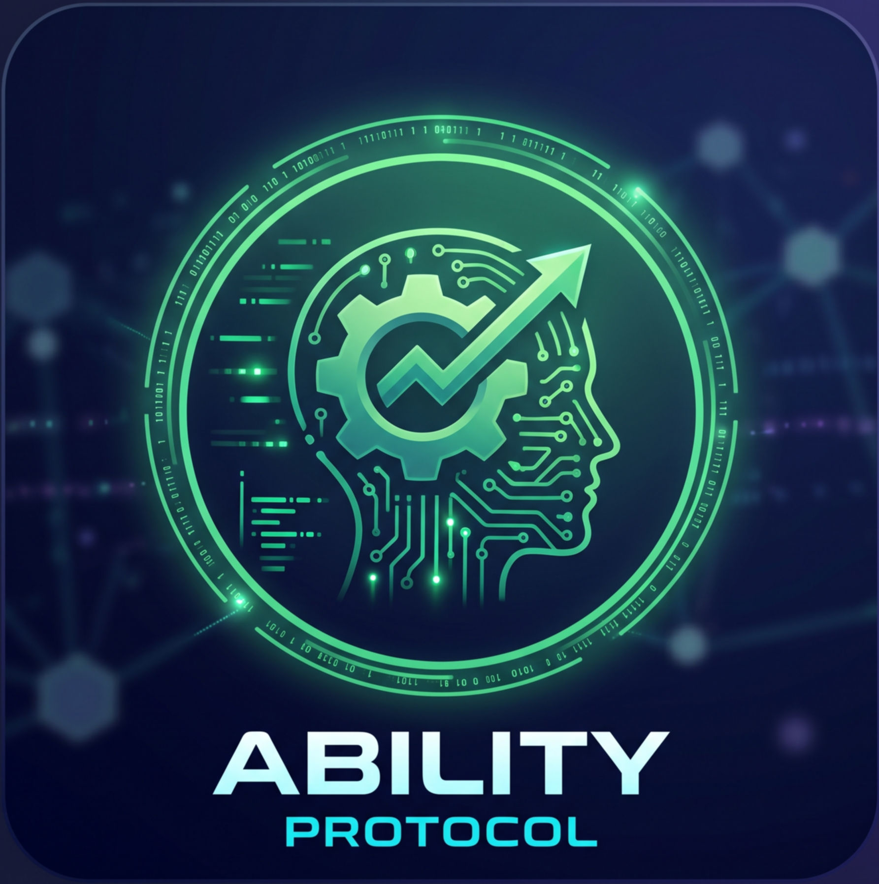
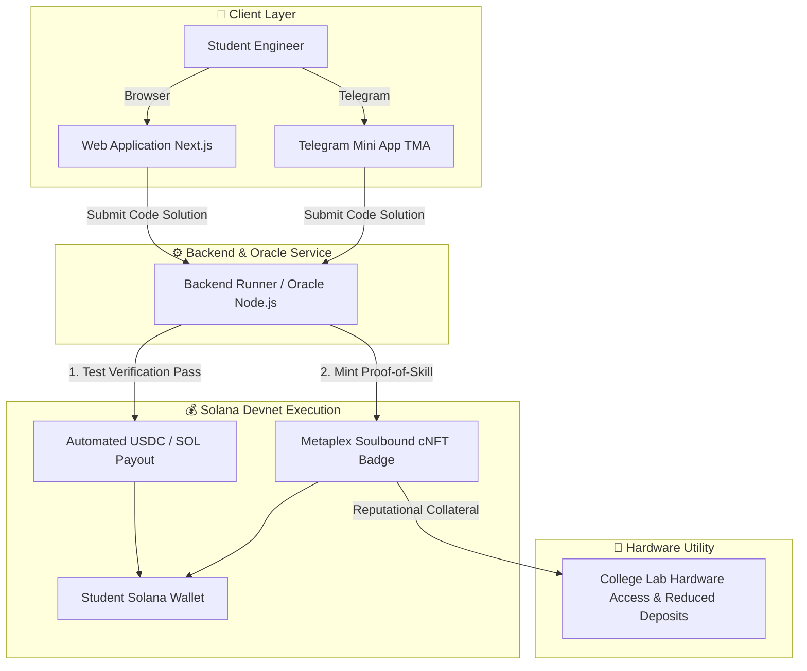

<p align="center">
  
</p>

# Ability Protocol ⚡

> **On-chain skill verification and escrow system on Solana, connecting technical students with sponsor bounties and lab resources through practical challenges.**

[](https://solana.com)
[](https://telegram.org/)
[](https://www.typescriptlang.org/)
[](https://nextjs.org/)
[](https://nodejs.org/)
[](https://metaplex.com/)
[](BUSINESS_PLAN.md)
[](LICENSE)

---

## 📑 Table of Contents

- [Overview](#-overview)
- [Business Plan & Strategy](#-business-plan--strategy)
- [Problem](#-problem)
- [Solution](#-solution)
- [Why Solana?](#-why-solana)
- [System Architecture](#-system-architecture)
- [Tech Stack](#-tech-stack)
- [Project Structure](#-project-structure)
- [Getting Started](#-getting-started)
  - [Prerequisites](#prerequisites)
  - [Installation & Setup](#installation--setup)
  - [Environment Configuration](#environment-configuration)
  - [Running the Application](#running-the-application)
- [Demo Day MVP Scope](#-demo-day-mvp-scope)
- [Team & Acknowledgements](#-team--acknowledgements)
- [License](#-license)

---

## 🌟 Overview

**Ability Protocol** transforms technical engineering education into liquid economic opportunity and portable credentials. By leveraging Solana Devnet micro-transactions, Telegram Mini Apps (TMA), and Metaplex Compressed NFTs, students solve practical engineering tasks, earn instant USDC/SOL rewards from sponsor bounty pools, and build an on-chain reputation that unlocks college lab hardware.

---

## 💼 Business Plan & Strategy

For the complete product economics, competitive matrix, anti-sybil architecture, and go-to-market strategy, explore the comprehensive **[Business Plan v1.0](BUSINESS_PLAN.md)**.

Highlights include:
- **Distribution via TMA:** Zero-friction onboarding directly inside Telegram channels and lab study groups.
- **Target User Segments:** Engineering students, university labs, and Web3/tech hiring sponsors.
- **Anti-Sybil Protections:** University email domain validation (`.edu.ua`), hidden test suites, and rate-limiting.
- **Monetization:** Escrow pool fees (5–8%), B2B talent assessment sprints, recruitment success fees, and lab inventory SaaS.

---

## 📌 Problem

- **🎓 For Students:** Technical students spend hundreds of hours solving programming tasks, labs, and electronics coursework, but their achievements remain trapped in academic grading sheets with zero verifiable proof and no immediate economic utility. Meanwhile, acquiring essential development hardware (microcontrollers, development boards, sensors) is expensive.
- **💼 For Sponsors & Tech Companies:** Sponsoring junior talent or hiring entry-level engineers is plagued by resume inflation and AI-generated quiz answers. Companies lack cryptographic guarantees that a student can solve real-world problems independently.
- **🔬 For College Labs:** Equipment sharing and peer-to-peer hardware exchanges lack accountability, resulting in trust barriers and inefficient hardware utilization.

---

## 💡 Solution

**Ability Protocol** bridges practical engineering competence with real incentives and physical resources using Solana:

1. **Practical Challenges:** Students complete verified technical tasks (JavaScript/Python scripts, logic tests, hardware code snippets).
2. **Dual-Access Interface (Web + Telegram Mini App):** Students launch challenges via desktop browser or natively inside Telegram with mobile wallet integration.
3. **On-Chain Escrow & Payouts:** Sponsors deposit bounty pools in Devnet USDC/SOL. When test runner verification passes, the protocol programmatically releases the reward directly to the student's wallet.
4. **Soulbound Skill Badges (cNFT):** Successful completions automatically mint non-transferable Metaplex Compressed NFTs to establish a tamper-proof skill passport.
5. **Hardware Access / Reputational Escrow:** Accumulated credentials act as on-chain collateral, lowering security deposits for borrowing college lab equipment and enabling trust-minimized P2P hardware exchanges.

---

## 🛠 Why Solana?

- **⚡ Sub-Cent Micro-Settlements:** Near-zero transaction fees make micro-bounties ($5–$20) economically viable without losing a third of the value to network fees.
- **🛡️ Non-Transferable Credentials (cNFTs):** Permanent and ultra-cheap educational badges powered by Metaplex Bubblegum that cannot be sold or transferred between wallets.
- **⏱️ Instant Finality:** Real-time state updates allow immediate verification, bounty distribution, and lab hardware unlocks.

---

## 🏗 System Architecture

```text
[ STUDENT ] ──► ( Web App / Telegram Mini App )
                       │
                       ▼
[ BACKEND RUNNER / ORACLE (Node.js) ]
     │ (1. Automated Tests PASS)
     ├──────────────────────────┐
     ▼                          ▼
(Solana Devnet: USDC Payout)   (Metaplex: Mint Soulbound cNFT)
     │                          │
     └─────────────┬────────────┘
                   ▼
[ Lab Hardware Access & Reduced P2P Collateral ]
```



---

## 💻 Tech Stack

| Category | Technologies | Description |
| :--- | :--- | :--- |
| **Client & Interface** | Next.js, React, TailwindCSS, `@telegram-apps/sdk` | Web application & Telegram Mini App (TMA) for seamless in-app execution |
| **Solana Integration** | `@solana/web3.js`, `@solana/wallet-adapter-react` | Wallet connection (Phantom, Solflare) and transaction signing |
| **Backend & Oracle Engine** | Node.js, TypeScript, Express / Next.js API Routes | Sandboxed code execution, test verification, and automated oracle dispatch |
| **Token & Bounties** | `@solana/spl-token` | SPL Tokens & Devnet USDC / SOL reward distributions |
| **Credentials & Badges** | Metaplex JS SDK (`@metaplex-foundation/umi`) | Non-transferable Compressed NFTs (cNFTs) via Bubblegum |
| **Network** | Solana Devnet | High-speed, zero-cost testnet deployment |

---

## 📂 Project Structure

```text
ability-protocol/
├── app/                       # Next.js frontend (Web + Telegram Mini App)
│   ├── src/components/        # Wallet adapter, code editor, challenge cards
│   └── src/app/               # App router pages
├── server/                    # Node.js backend & verification service
│   ├── src/services/solana.ts # Payout & escrow logic (@solana/web3.js)
│   └── src/index.ts           # Verification endpoint
├── assets/                    # Project logos and visual media
├── BUSINESS_PLAN.md           # Pitch & strategic business documentation
└── README.md                  # Technical architecture and setup guide
```

---

## 🚀 Getting Started

### Prerequisites

Ensure you have the following installed on your local machine:

- **[Node.js](https://nodejs.org/)** (v18.x or later)
- Package manager: **npm**, **pnpm**, or **yarn**
- **Solana Wallet Extension / App:** [Phantom](https://phantom.app/) or [Solflare](https://solflare.com/) configured to **Solana Devnet**
- *(Optional)* **Telegram Desktop / Mobile:** For testing the Telegram Mini App integration

### Installation & Setup

1. **Clone the repository:**
   ```bash
   git clone https://github.com/<your-username>/ability-protocol.git
   cd ability-protocol
   ```

2. **Install frontend dependencies:**
   ```bash
   cd app
   npm install
   ```

3. **Install server dependencies:**
   ```bash
   cd ../server
   npm install
   ```

### Environment Configuration

Create a `.env.local` file inside `server/` (and `app/`):

```env
NEXT_PUBLIC_SOLANA_RPC_URL=https://api.devnet.solana.com
NEXT_PUBLIC_SOLANA_NETWORK=devnet
BACKEND_PAYER_PRIVATE_KEY=<your-devnet-keypair-base58-or-array>
TELEGRAM_BOT_TOKEN=<your-telegram-bot-token>
```

### Running the Application

1. **Start the verification engine (backend):**
   ```bash
   cd server
   npm run dev
   ```

2. **Start the client application (Web + TMA):**
   ```bash
   cd ../app
   npm run dev
   ```

3. **Open in browser or Telegram:**
   - Web Portal: Visit [http://localhost:3000](http://localhost:3000)
   - TMA: Open via your Telegram Bot WebApp URL

---

## 🎯 Demo Day MVP Scope

- [ ] **Sponsor Bounty Pool Setup:** Configured Devnet USDC / SOL balance vault.
- [ ] **Interactive Technical Challenge:** In-browser coding & logic task UI.
- [ ] **Telegram Mini App (TMA) Integration:** Responsive interface for seamless mobile/desktop Telegram access.
- [ ] **Automated Verification:** Code & task solution verification engine.
- [ ] **Programmatic Bounty Payout:** Instant distribution via `@solana/web3.js` on Solana Devnet.
- [ ] **Soulbound Skill Minting:** Proof-of-Skill badge minting via Metaplex Bubblegum.
- [ ] **Lab Hardware Access Scenario:** Credential-gated equipment borrowing with reduced deposits.

---

## 👥 Team & Acknowledgements

- **Development & Architecture:** **Irpin Specialized College of NULES of Ukraine**
- **Hackathon:** Built for the **IFK Colosseum Sprint 2026** & **Colosseum Hackathon**

---

## 📄 License

This project is open-source and licensed under the [MIT License](LICENSE).
